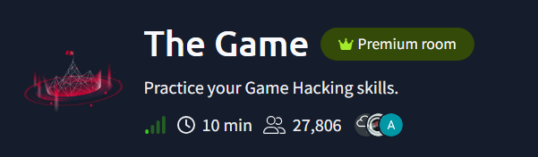
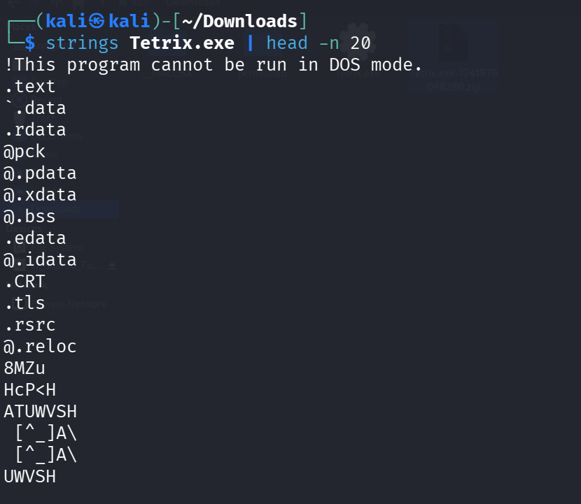
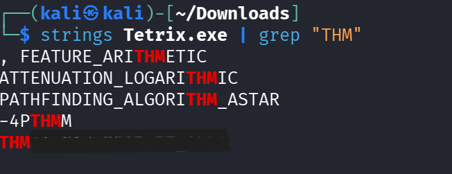

# TryHackMe - The Game

> **Difficulty:** Easy
## Room Information

- **Link:** [The Game](https://tryhackme.com/room/hfb1thegame)



---

## Looking for the Flag

This room is straightforward. After downloading the provided archive, it contains a Windows executable (`.exe`) that needs to be analyzed to recover the flag.

Since executing unknown binaries is generally not recommended, static analysis is the safest approach. I started by using the `strings` command to extract all printable strings embedded in the executable.

```bash
strings Tetrix.exe
```

The output is quite large, so only a portion is shown below.



Because most TryHackMe flags begin with `THM`, I filtered the output using `grep` to search only for matching strings.

```bash
strings Tetrix.exe | grep "THM"
```



The command immediately reveals the flag.

---

## Key Takeaways

- `strings` is useful for performing quick static analysis on binaries.
- `grep` helps narrow down large outputs by searching for specific patterns.
- Always try static analysis before executing an unknown executable.
